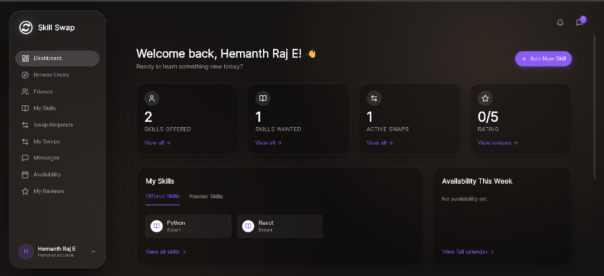
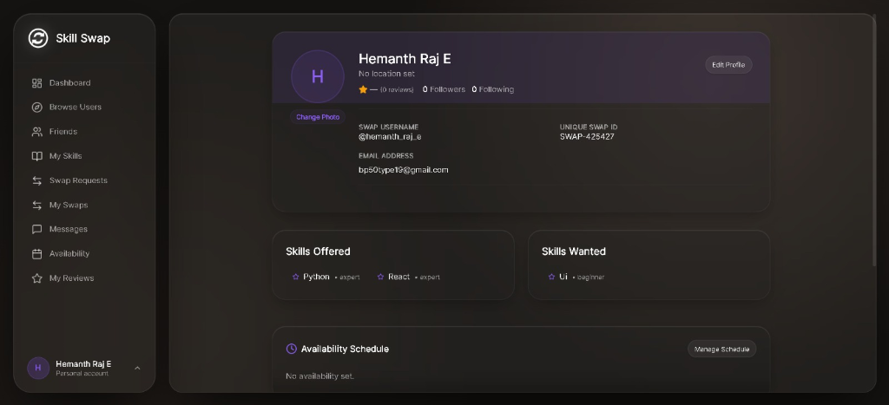
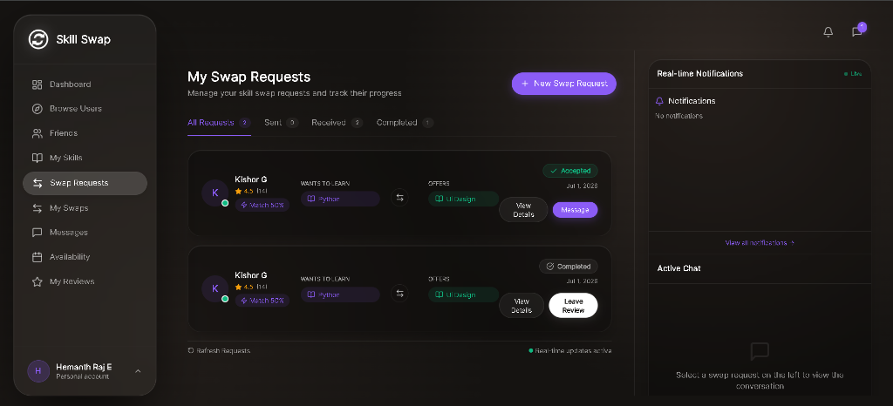
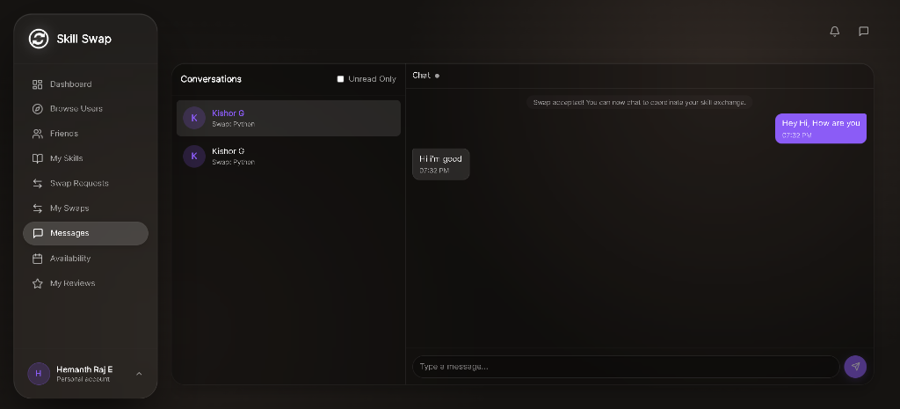

<div align="center">
  
  <h1>Skill Swap</h1>
  <p>A platform for learning and teaching skills through mutual exchanges.</p>

  [](https://opensource.org/licenses/MIT)
  [](https://www.python.org/)
  [](https://reactjs.org/)
  [](https://www.postgresql.org/)
</div>

---

## 1. Project Overview
Skill Swap is a modern, responsive web application that connects individuals who want to learn new skills with those willing to teach them. Rather than using money, users exchange time and knowledge through a "skill swap" mechanism. The platform handles user matching, real-time communication, and session scheduling.

## 2. Why this project exists
This project was built to demonstrate full-stack engineering capabilities, focusing on real-time data flow, secure authentication, and a clean, accessible user interface. It serves as a comprehensive portfolio piece showcasing the integration of modern frontend frameworks with robust backend architectures.

## 3. Key Features
- **Skill Matching Engine:** Uses AI (Google Gemini) to analyze user profiles and calculate a compatibility "Match Score" before swaps are proposed.
- **Real-Time Chat:** Integrated WebSocket (Socket.IO) messaging allows users to communicate instantly once a swap request is accepted.
- **Swap Lifecycle Management:** Users can propose, accept, reject, and complete swaps, with the backend strictly enforcing state transitions.
- **Session Scheduling:** Integrated calendar scheduling for planning video calls or meetups.
- **Responsive "Liquid Glass" UI:** A premium, dark-mode-first aesthetic with translucent panels and dynamic animations that adapts seamlessly to desktop and mobile viewports.
- **Admin Dashboard:** A role-based protected area for platform monitoring and user moderation.

## 4. Architecture Overview
Skill Swap uses a Client-Server Single Page Application (SPA) architecture. 
The **Frontend** handles routing and state management (React + TanStack Query) and communicates with the backend via RESTful APIs and WebSocket connections.
The **Backend** acts as the central API gateway (Flask), enforcing business logic, handling real-time chat events, and communicating with the **Database** (PostgreSQL) via an ORM (SQLAlchemy). External services are used for image hosting (Cloudinary) and AI processing (Gemini).

## 5. Tech Stack
| Category | Technology |
|---|---|
| **Frontend** | React 18, Vite, TypeScript, React Router, TanStack Query, Socket.IO Client, Vanilla CSS |
| **Backend** | Python 3.11, Flask, Flask-SQLAlchemy, Flask-SocketIO, Flask-Login, Flask-WTF (CSRF) |
| **Database** | PostgreSQL (Neon), Alembic (Migrations) |
| **Integrations** | Cloudinary (Image Hosting), Google Gemini (AI Matching) |

## 6. Folder Structure
```text
skill-swap/
├── backend/                  # Python/Flask backend API
│   ├── app/                  # Main application logic
│   │   ├── models/           # SQLAlchemy database schemas
│   │   ├── routes/           # REST API endpoints
│   │   └── utils/            # Helper functions (AI, Image Upload)
│   ├── migrations/           # Alembic database migration scripts
│   ├── tests/                # Pytest integration suite
│   ├── render.yaml           # Deployment configuration for Render
│   └── requirements.txt      # Python dependencies
├── docs/                     # Detailed architectural and security reports
└── frontend/                 # React frontend application
    ├── public/               # Static assets (icons, SVGs)
    ├── src/
    │   ├── components/       # Reusable UI components
    │   ├── context/          # React Context (Auth, WebSockets)
    │   ├── lib/              # API clients and utility functions
    │   └── pages/            # Application views (Dashboard, Messages)
    └── vercel.json           # Deployment configuration for Vercel
```

## 7. Database Schema Overview
The relational schema ensures data integrity through strict foreign key constraints and cascading deletions:
- `users`: Core identity table (hired passwords, emails).
- `skills`: Dictionary of available skills.
- `user_skills`: Many-to-many bridge linking users to their offered/wanted skills.
- `swap_requests`: Tracks the lifecycle state of a skill exchange between a sender and receiver.
- `chat_messages`: Stores timestamps and content for messages linked to an accepted swap.

## 8. Screenshots








## 9. Demo
[Watch the Skill Swap Demo Video](https://drive.google.com/file/d/10L1LvdfU6O8x8EK2K65rJrpCyY70oKwy/view?usp=sharing)

---

## 10. Installation Guide

### Prerequisites
To run this project locally, you must have the following installed on your machine:
- **Git** (for cloning the repository)
- **Node.js** (v18 or higher)
- **Python** (v3.10 or higher)
- A local **PostgreSQL** database (or a remote URL like Neon)

### 11. Environment Variables
Create a `.env` file in the `backend/` directory by copying the example file:
```bash
cp backend/.env.example backend/.env
```
Update the `.env` file with your specific keys:
- `SECRET_KEY`: A secure random string for Flask sessions.
- `DATABASE_URL`: Your PostgreSQL connection string.
- `CLOUDINARY_*`: Keys from your Cloudinary dashboard.
- `GEMINI_API_KEY`: Key from Google AI Studio.

### 12. Local Development Setup

#### Running the Backend
1. Open a terminal and navigate to the backend folder:
   ```bash
   cd backend
   ```
2. Create and activate a Python virtual environment:
   - Windows: `python -m venv venv && venv\Scripts\activate`
   - Mac/Linux: `python3 -m venv venv && source venv/bin/activate`
3. Install the required Python dependencies:
   ```bash
   pip install -r requirements.txt
   ```
4. Run the database migrations to build your local schema:
   ```bash
   flask db upgrade
   ```
5. Start the backend server (runs on port 5000):
   ```bash
   python run.py
   ```

#### Running the Frontend
1. Open a **new** terminal window and navigate to the frontend folder:
   ```bash
   cd frontend
   ```
2. Install the Node dependencies:
   ```bash
   npm install
   ```
3. Start the Vite development server (runs on port 5173):
   ```bash
   npm run dev
   ```
4. Open your browser and navigate to `http://localhost:5173`.

### 13. Running Tests
The backend contains a suite of over 100 integration tests. To run them locally:
```bash
cd backend
pytest
```

---

## 14. Deployment Guide

### Backend (Render)
1. Connect your GitHub repository to [Render](https://render.com/).
2. Create a new "Web Service".
3. Render will automatically detect the `render.yaml` configuration file and deploy the Flask application using Gunicorn and Gevent for WebSocket support.
4. Add all your `.env` variables to the Render dashboard.

### Frontend (Vercel)
1. Connect your GitHub repository to [Vercel](https://vercel.com/).
2. Select the `frontend` directory as the Root Directory.
3. Vercel will automatically detect Vite and the `vercel.json` file for client-side routing.
4. Deploy the application.

---

## 15. API Overview
The backend exposes a standard RESTful JSON API:
- `/api/auth/*` - Registration, Login, Session Check, Logout.
- `/api/users/*` - Profile management, User discovery.
- `/api/swaps/*` - Swap request lifecycle management.
- `/api/admin/*` - Protected moderation and statistics endpoints.

## 16. Project Highlights
- **Performance:** Complex N+1 database queries were optimized using SQLAlchemy joined loads and strict foreign-key indexing.
- **Resilience:** Global error handling safely intercepts exceptions without leaking stack traces to the client.
- **Strict Typing:** The frontend relies heavily on TypeScript interfaces to guarantee predictable data flow from the API.

## 17. Security Features
- **Password Protection:** `bcrypt` cryptographic hashing.
- **XSS Defense:** Backend sanitization using `bleach` on user-generated inputs.
- **Session Security:** `HttpOnly`, `Secure`, and `SameSite` flags actively enforced on all cookies.
- **CSRF Defense:** `Flask-WTF` token validation on all state-changing requests.
- **Brute Force Protection:** IP-based rate limiting on authentication routes.

## 18. Future Improvements
- Implement email verification upon registration.
- Add WebRTC for in-browser video calls.
- Integrate a robust search indexing tool (like Elasticsearch) for advanced skill filtering.

## 19. Troubleshooting
- **Cannot connect to database:** Ensure your PostgreSQL server is running and the `DATABASE_URL` is formatted correctly in `.env`.
- **WebSocket dropping:** If deploying behind an Nginx reverse proxy, ensure standard WebSocket headers (`Upgrade: websocket`) are properly forwarded.

## 20. License
This project is licensed under the MIT License. See the [LICENSE](LICENSE) file for details.

## 21. Author
Built by [Kishor](https://github.com/Kxhor).
