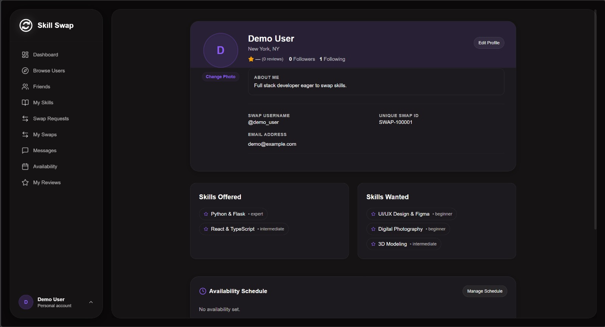
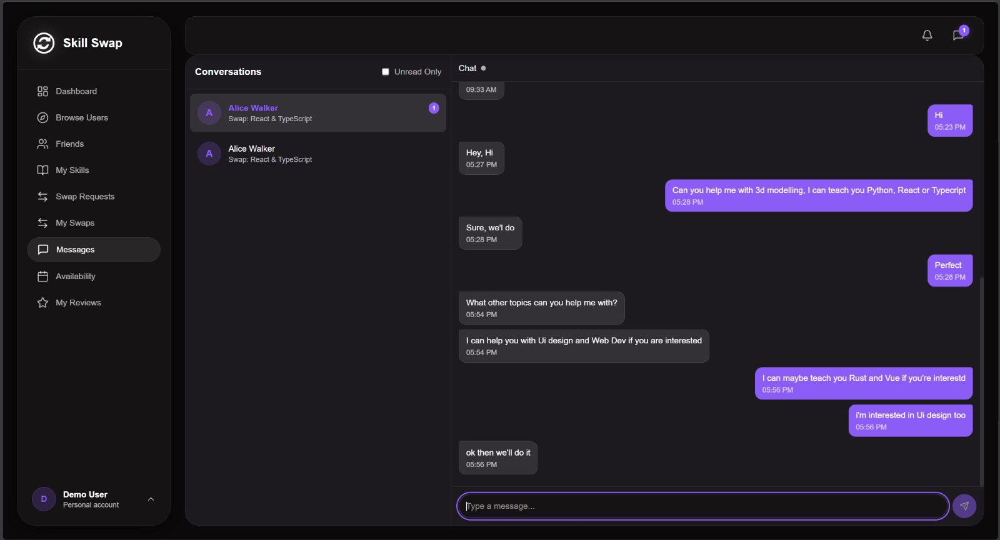
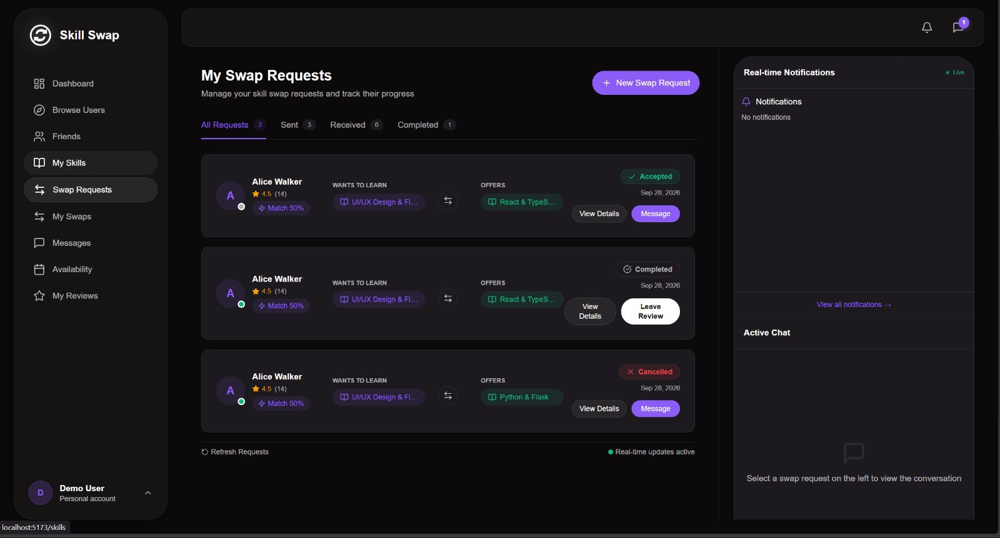
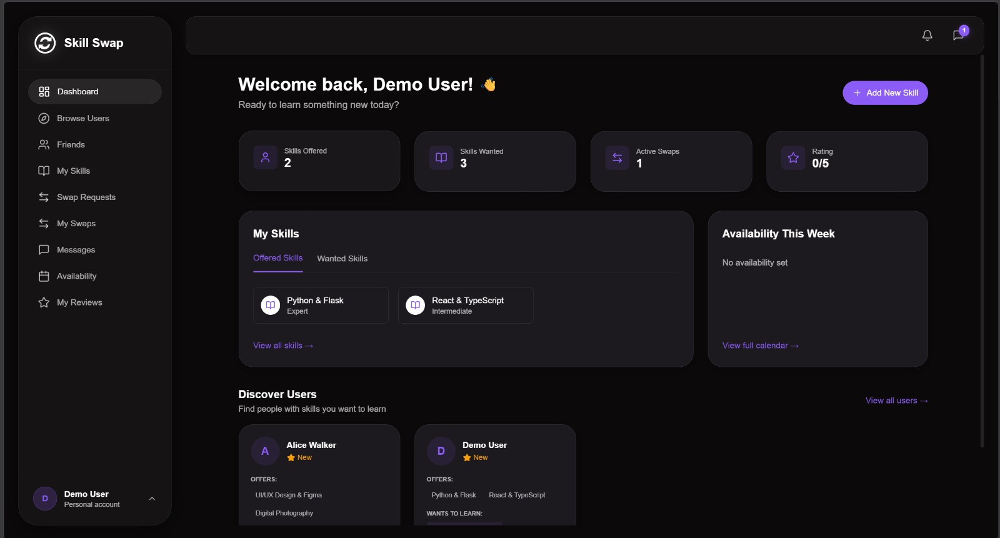
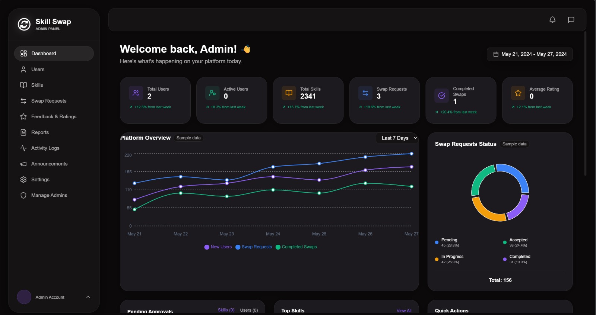

<div align="center">
  
  <h1>Skill Swap</h1>
  <p>An enterprise-grade peer-to-peer knowledge exchange platform with automated skill matching and real-time collaboration.</p>

  [](https://opensource.org/licenses/MIT)
  [](https://www.python.org/)
  [](https://flask.palletsprojects.com/)
  [](https://react.dev/)
  [](https://www.typescriptlang.org/)
  [](https://tailwindcss.com/)
  [](https://www.postgresql.org/)
  [](https://socket.io/)
</div>

***

## 1. Executive Summary

Skill Swap is a full-stack platform designed to facilitate decentralized skill sharing between peers. Rather than relying on monetary transactions, users offer their specific domain expertise in return for learning desired skills from complementary partners.

The platform provides intelligent compatibility scoring through Google Gemini, bidirectional swap negotiation workflows, WebSocket-driven instant messaging, calendar synchronization, and an administrative control panel for moderation and platform metrics.

***

## 2. Core Platform Capabilities

* **Artificial Intelligence Compatibility Matching:** Profile attributes and offered/wanted skill matrices are evaluated using Google Gemini to produce reciprocal compatibility percentages.
* **Bi-Directional State Machine:** Swap requests transition predictably through strictly enforced lifecycle states: pending, accepted, rejected, cancelled, and completed.
* **Real-Time Communication:** Persistent Socket.IO channels provide low-latency chat messaging, user presence tracking, and typing indicators.
* **Session Scheduling:** Integrated calendar proposal and confirmation flow for planning learning sessions.
* **Responsive Dark-Themed User Interface:** Modern interface styled with utility-first CSS, custom glassmorphism surfaces, and strict WCAG AA contrast standards.
* **Role-Based Access Control:** Separate authentication domains for platform members and administrators, with endpoint-level authorization guards.

***

## 3. Screenshots

### User Profile and Skill Matrix


### Real-Time Chat and Messaging


### Swap Requests Management


### Partner Discovery and Profiles


### Administrative Operations Dashboard


***

## 4. System Architecture

The solution implements a decoupled client-server architecture:

```text
+-----------------------------------------------------------------+
|                     Client Tier (React SPA)                    |
|  - TypeScript, React Router, TanStack Query, Tailwind CSS v4    |
|  - State management, client-side validation, socket listeners   |
+-------------------------------+---------------------------------+
                                |
               HTTP REST APIs   |   WebSocket Events
               (JSON Payloads)  |   (Socket.IO Protocol)
                                |
+-------------------------------+---------------------------------+
|                     Application API Gateway                     |
|  - Python Flask, Flask-Login, Flask-WTF (CSRF), Flask-Limiter   |
|  - Request validation, authentication, rate limiting, profanity |
+-------------------------------+---------------------------------+
                                |
         +----------------------+----------------------+
         |                                             |
+--------+--------+                           +--------+--------+
| Database Tier   |                           | Cloud Services  |
| - PostgreSQL    |                           | - Google Gemini |
| - SQLAlchemy    |                           | - Cloudinary    |
| - Alembic       |                           +-----------------+
+-----------------+
```

***

## 5. Technology Stack

| Domain | Technologies |
| :--- | :--- |
| **Frontend Framework** | React 18, TypeScript, Vite, React Router DOM |
| **Data Fetching and Cache** | TanStack React Query (v5) |
| **Styling and Components** | Tailwind CSS (v4 CSS-first), Lucide Icons, Radix UI Primitives |
| **Backend Framework** | Python 3.10+, Flask, Flask-SQLAlchemy, Flask-Login |
| **Real-Time Transport** | Flask-SocketIO, Socket.IO Client, Gevent WebSocket |
| **Security and Validation** | Flask-WTF (CSRF), Flask-Limiter, Bleach, Cryptography, Bcrypt |
| **Database** | PostgreSQL / SQLite (Development) |
| **External Integrations** | Google Gemini Generative AI, Cloudinary Media Storage |

***

## 6. Directory Layout

```text
Skill-swap/
├── backend/
│   ├── app/
│   │   ├── models/            # SQLAlchemy database models
│   │   ├── routes/            # REST API route blueprints
│   │   ├── utils/             # Gemini matching, profanity filtering, validators
│   │   ├── extensions.py      # Extension instances
│   │   └── socket_events.py   # WebSocket event handlers
│   ├── migrations/            # Alembic schema migration records
│   ├── tests/                 # Automated pytest test suite
│   ├── .env.example           # Template for backend configuration
│   ├── requirements.txt       # Python package dependencies
│   ├── run.py                 # Application startup script
│   └── wsgi.py                # Production WSGI entry point
├── docs/
│   └── screenshots/           # Application screenshots and assets
├── frontend/
│   ├── public/                # Static web assets
│   ├── src/
│   │   ├── components/        # Reusable UI widgets and layout shells
│   │   ├── context/           # Authentication and socket providers
│   │   ├── hooks/             # Custom React Query hooks
│   │   ├── lib/               # HTTP client and constants
│   │   └── pages/             # Application route views
│   ├── package.json           # Node.js dependencies and scripts
│   └── vite.config.ts         # Vite build and proxy configuration
├── .gitignore                 # Version control exclusions
└── README.md                  # Project documentation
```

***

## 7. Getting Started

Follow the instructions below to configure and run the application locally.

### Prerequisites

Ensure the following tools are installed:
* **Node.js** (v18.0.0 or higher) and npm
* **Python** (v3.10.0 or higher)
* **Git**

### Step 1: Clone the Repository

```bash
git clone https://github.com/Kxhor/Skill-swap.git
cd Skill-swap
```

### Step 2: Backend Setup

1. Open a terminal in the project root and navigate to the backend directory:
   ```bash
   cd backend
   ```

2. Create and activate a Python virtual environment:
   * **Windows:**
     ```powershell
     python -m venv .venv
     .venv\Scripts\activate
     ```
   * **Linux / macOS:**
     ```bash
     python3 -m venv .venv
     source .venv/bin/activate
     ```

3. Install backend dependencies:
   ```bash
   pip install -r requirements.txt
   ```

4. Configure environment settings:
   Create a `.env` file in the `backend/` directory by copying the sample template:
   ```bash
   cp .env.example .env
   ```
   *Note: For local testing, SQLite is supported out of the box if no external database URL is specified.*

5. Launch the backend server:
   ```bash
   python run.py
   ```
   The backend service starts at `http://127.0.0.1:5005`.

### Step 3: Frontend Setup

1. Open a separate terminal window and navigate to the frontend directory:
   ```bash
   cd frontend
   ```

2. Install Node packages:
   ```bash
   npm install
   ```

3. Start the frontend development server:
   ```bash
   npm run dev
   ```
   The frontend interface is accessible at `http://localhost:5173`.

***

## 8. Pre-Configured Test Accounts

The local development seed provides pre-configured accounts for testing:

| Role | Email | Password | Primary Purpose |
| :--- | :--- | :--- | :--- |
| **Standard User** | `demo@example.com` | `password123` | Tests profile creation and outgoing swap proposals |
| **Partner User** | `alice@example.com` | `password123` | Tests reciprocal swap approval, messaging, and reviews |
| **Administrator** | `admin@example.com` | `adminpassword123` | Accesses the `/admin` moderation and telemetry console |

***

## 9. Verification and Quality Assurance

The codebase includes an automated regression test suite covering security, authentication, and swap lifecycles.

### Run Backend Tests

```bash
cd backend
pytest
```
*Result: 142 integration tests verifying API boundaries, permission checks, and data models.*

### Run Frontend Production Build

```bash
cd frontend
npm run build
```
*Result: Validates TypeScript compilation and generates optimized production bundles with zero diagnostics errors.*

***

## 10. Security Implementation

* **Cryptographic Password Storage:** Passwords hashed with salt via Bcrypt.
* **Cross-Site Request Forgery Protection:** Stateful CSRF tokens validated on all mutating HTTP verbs via Flask-WTF.
* **Rate Limiting:** IP-based throttles via Flask-Limiter to defend against automated abuse.
* **Content Sanitization:** User inputs sanitized with Bleach to eliminate persistent script injection risks.
* **Session Hardening:** Cookies configured with `HttpOnly`, `SameSite=Lax`, and secure session handling.

***

## 11. Engineering Team

This project was engineered collaboratively by:

* **Kishor G**
* **Hemanth Raj E**

***

## 12. License

This project is distributed under the terms of the MIT License. See the [LICENSE](LICENSE) file for complete licensing terms.
